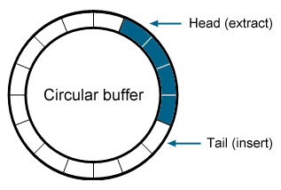

# Circular Queue

A circular queue uses a list as its underlying data
structure, not linked nodes. This differs from the [Linked
List](../linked_list/README.md) and [Linked
Queue](../linked_queue/README.md) data structures.

A _circular queue_ is a data structure that has four
properties:

* `size` tells the queue the maximum number of elements that
  can be stored in the queue
* `length` is how many items are in the queue
* `head` points to the index in the underlying list that is
  the "start" of the queue
* `tail` points to the index in the underlying list that is
  the "end" of the queue.

The _circular queue_ has two methods:

* `enqueue` adds a value to the end of the queue unless the
  queue is full because the number of items in it is equal
  to the _size_ parameter
* `dequeue` removes the value at the head of the queue and
  returns the value, or raises a `IndexError` if the queue
  has no values in it



There are several times that you may want to use a circular
queue:

* Scheduling items in an application
* Loading large amounts of data from a data source
* Maintaining a list of players (and their turns) in a game

You have two options about how to approach this problem.

## Test-driven development

To do the test-driven development method, change the working
directory to this directory, _./circular\_queue_. Then,
step-by-step, start with running this command.

```sh
python -m pytest tests/test_01.py
```

Once you make that test pass, run the next test file,
_tests/test\_02.py_. Make the new test pass. Then continue
on with the next test until you get to the last one, test
file number 9.

## All-at-once development

If you feel like just jumping right in, you can run this
command.

```sh
python -m pytest tests/test_09.py
```

That will run all of the tests for the circular queue. Just
make them all pass.
